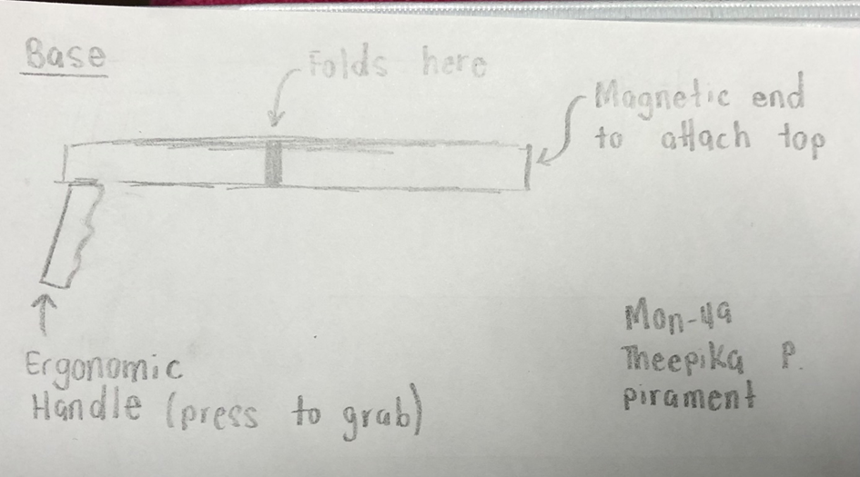
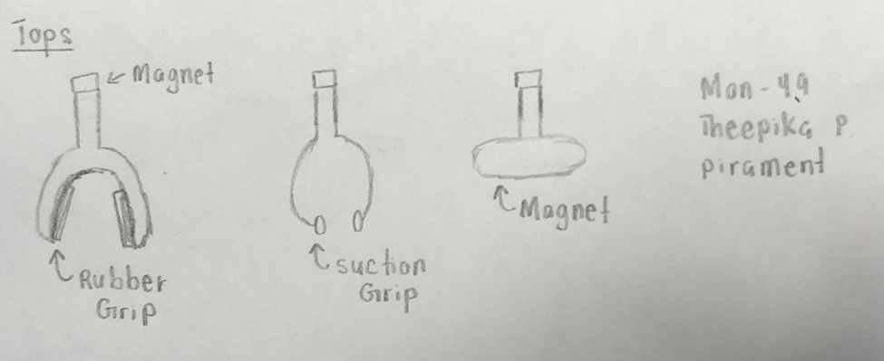
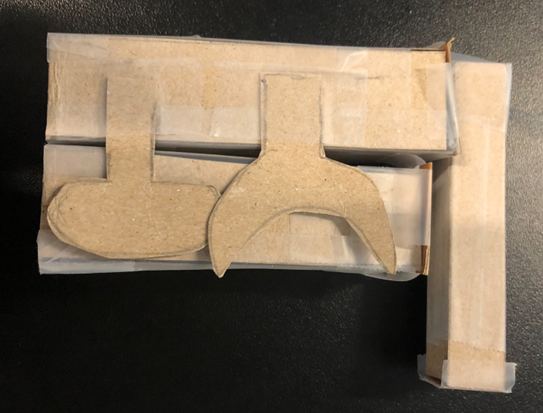
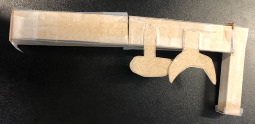
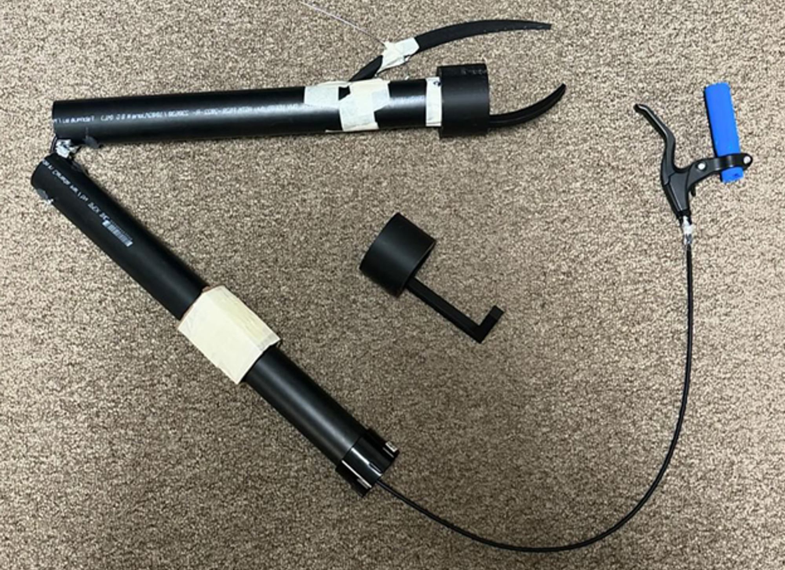

# Assistive-Reach-Grabber-Design
This project focused on developing an assistive device to improve independence for a client who experienced challenges with certain daily activities due to limited reach and mobility. The existing reach grabber used by the client was too large and fragile for their work environment.

Our team designed and prototyped a **portable and durable reacher grabber** with a folding mechanism and interchangeable tops to support different tasks.

## Project Objectives

The design was aimed to:

- Maximize the weight the device could support
- Maximize reach distance
- Improve portability
- Minimize weight
- Maximize user comfort

## Functions

The device was designed to:
- Pick up objects of different shapes and sizes
- Securely hold objects during use

## Design Requirement & Constraints

The final design had to meet several requirements:

- Weigh less than 2.5 kg
- Fit inside the client's bag
- Cost less than $50 to manufacture
- Provide sufficient reach for the intended tasks
- Be durable enough for regular use

## Initial Design Concepts

The project began with brainstorming and sketching different concepts for the reach grabber. I contributed to the early design process by creating initial sketches and exploring possible mechanisms for the final device.

*Base Part of Rough Sketch*

*Tops of Rough Sketch*

## Low-Fidelity Prototype

Low-fidelity prototypes were created to test and evaluate the proposed design before developing the final prototype. I contributed to creating and evaluating these early prototypes.

*Low Fidelity Prototype (Retracted)*

*Low Fidelity Prototype (Extended)*

The prototyping process helped us evaluate the portability and folding mechanism while identifying areas for improvement before developing the final design.

## Final Design

The final prototype was a handheld reach extension device designed to improve the client's ability to pick up objects independently.

The design incorporated several key components:

- **PVC pipe shaft** for the main body
- **3D-printed claws and handles**
- **Bicycle brake mechanism** for the gripping system
- **Modular interchangeable tops** for different objects and tasks
- **Folding mechanism** for easier transportation

*Final Reacher Grabber*

## Testing & Evaluation
I contributed to developing a testing plan for the prototype to evaluate its performance and ensure that the design addressed the project's requirements.

The testing process considered factors such as:
- Weight supported
- Reach distance
- Portability
- Ease of use
- Ability to securely grip different objects

## My Role - Coordinator

As the Coordinator, I was responsible for helping organize the team while also contributing to the design and development of the prototype.

### Coordinator Contributions
- Arranged team meetings apart from the weekly Design Studios
- Kept a record of all meetings and discussions outside of weekly Design Studios

### Technical Contributions
- Provided input for the final prototype design
- Created initial sketches and low fidelity prototypes for the final design
- Formulated a testing plan for the prototype
- Prepared a presentation for the pitch

## Tools & Technologies
- **3D Printing** - Prototyping and manufacturing components
- **Microsoft PowerPoint** - Project presentation and pitch
- **Microsoft Excel** - Project organization and analysis
- **Sketching** - Initial concept development

## Skills Demonstrated

### Technical Skills
- Product Design
- Prototyping
- 3D Printing
- Design Development
- Testing & Evaluation
- Sketching

### Professional Skills
- Project Coordination
- Time Management
- Oral Communication
- Written Communication
- Problem-Solving
- Team Collaboration

## Key Takeaways
This project taught me the importance of communication and assertiveness when working within a team. When some team members were not contributing equally, I initially hesitated to address the issue. This resulted in additional workload and frustration. Eventually, I addressed the situation and helped establish a fairer distribution of work.

The project also taught me the importance of considering a wide range of solutions when designing for different user needs. Our final design included two modular tops, but they were similar in function. Looking back, a foam attachment for irregularly shaped objects and a magnetic attachment for metal objects could have provided greater versatility.

Overall, this project strengthened my understanding of prototyping, teamwork, and creative problem-solving, while showing me the importance of designing solutions around the specific needs of the user.
